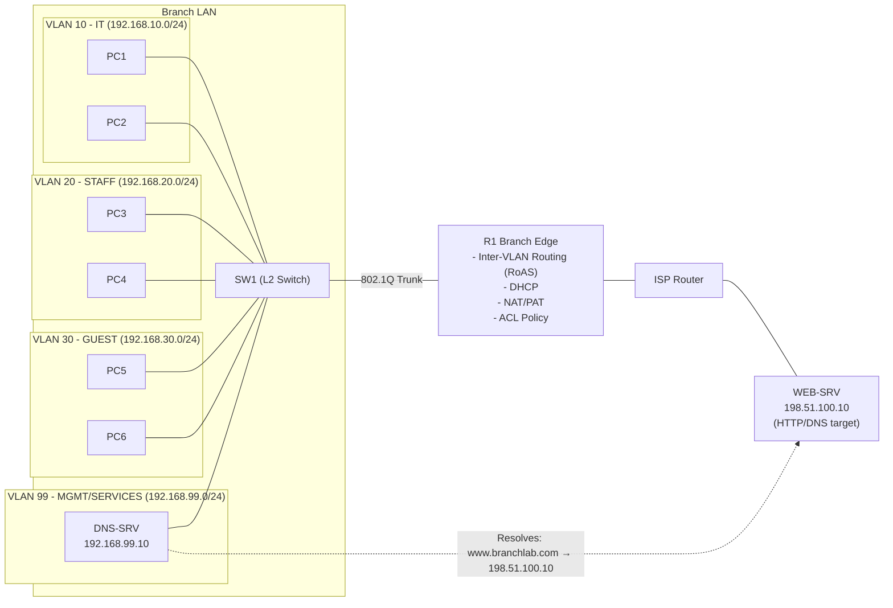

# Logical Diagrams (Mermaid)

These Mermaid diagrams provide a **logical view** of Project 04 traffic flow and service placement.
For detailed physical topology, see the images in `/topology`.

---

## Version 1 – Centralized Branch Edge (R1 Router-on-a-Stick)



## Version 2 – Remote Guest Subnet + DHCP Relay (R2)

```mermaid
flowchart LR
  subgraph BRANCH["Branch LAN"]
    SW1["SW1"]
    subgraph V10["VLAN10 IT 192.168.10.0/24"]
      PC1["PC1"]
      PC2["PC2"]
    end
    subgraph V20["VLAN20 STAFF 192.168.20.0/24"]
      PC3["PC3"]
      PC4["PC4"]
    end
    subgraph V99["VLAN99 MGMT/SVC 192.168.99.0/24"]
      DNS["DNS-SRV 192.168.99.10"]
    end
  end

  subgraph REMOTE["Remote Guest"]
    SW2["SW2"]
    subgraph V30["VLAN30 GUEST 192.168.30.0/24"]
      PC5["PC5"]
      PC6["PC6"]
    end
  end

  R1["R1 (DHCP/NAT Edge)"]
  R2["R2 (GW 192.168.30.1 + Relay)"]
  ISP["ISP"]
  WEB["WEB-SRV 198.51.100.10"]

  PC1 --- SW1
  PC2 --- SW1
  PC3 --- SW1
  PC4 --- SW1
  DNS --- SW1
  SW1 --- R1

  PC5 --- SW2
  PC6 --- SW2
  SW2 --- R2

  R2 --- R1
  R1 --- ISP
  ISP --- WEB
