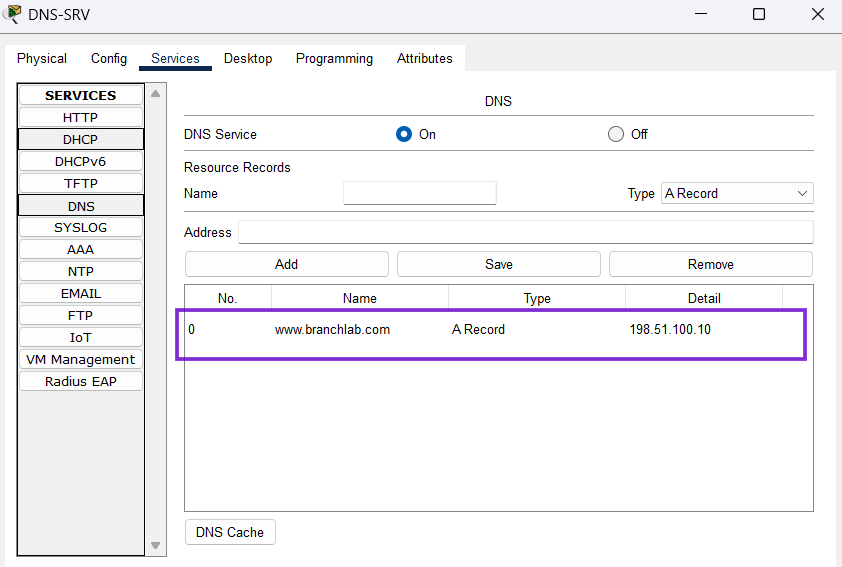

# DNS Validation – Version 1

## Objective
Validate that internal clients can resolve the public web server hostname using the internal DNS server.

## Scope
This validation confirms that:

- DNS-SRV is reachable where policy allows
- the DNS service is enabled on the server
- the DNS A record for `www.branchlab.com` is configured correctly
- clients can resolve the hostname to the public server IP
- DNS resolution supports end-to-end reachability testing

## DNS Design
In Version 1, DNS is provided by an internal server located in VLAN 99.

### DNS Server
- DNS-SRV: `192.168.99.10`

### DNS Record
- `www.branchlab.com` → `198.51.100.10`

## Validation Steps
1. Verify the DNS service is enabled on DNS-SRV
2. Verify the A record exists for `www.branchlab.com`
3. Confirm clients receive `192.168.99.10` as their DNS server
4. Test name resolution from permitted client VLANs
5. Confirm successful reachability to the public web server by name

## Verification Commands

### On Clients
```bash
ipconfig
ping www.branchlab.com
```

## Expected Result
- `www.branchlab.com` resolves to `198.51.100.10`
- permitted clients can successfully reach the public web server by name

## Observed Result
Validation succeeded. Clients were able to resolve `www.branchlab.com` to `198.51.100.10` using the internal DNS server and successfully reach the public web server by hostname.

## Technical Note
ACL design allowed DNS application traffic without allowing general ICMP to the DNS server from restricted VLANs. As a result, direct ping to `192.168.99.10` could fail while hostname resolution still worked correctly. This behavior is consistent with the intended policy.

## Supporting Evidence
### DNS Server Evidence (A Record)
  

### Client Evidence (Example: VLAN 10 PC1)
#### VLAN 10 PC1 – DNS Server Assignment
```
IP Address......................: 192.168.10.21
Subnet Mask.....................: 255.255.255.0
Default Gateway.................: 192.168.10.1
DNS Server......................: 192.168.99.10  <---
```
```
C:\>ping www.branchlab.com (198.51.100.10)

Pinging 198.51.100.10 with 32 bytes of data:

Request timed out.
Request timed out.
Reply from 198.51.100.10: bytes=32 time<1ms TTL=126
Reply from 198.51.100.10: bytes=32 time<1ms TTL=126

Ping statistics for 198.51.100.10:
    Packets: Sent = 4, Received = 2, Lost = 2 (50% loss)
```


